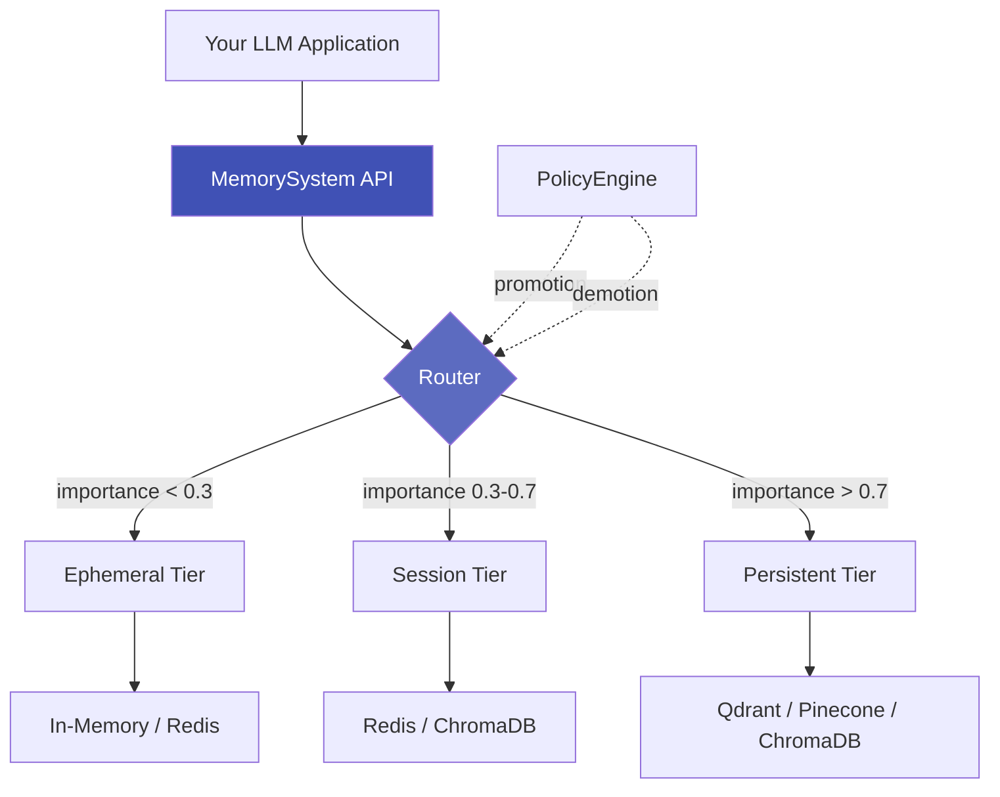

# Axon

<div align="center">

**Unified Memory SDK for LLM Applications**

[](LICENSE)
[](https://www.python.org/downloads/)
[](https://github.com/yourusername/Axon)
[](tests/)
[](htmlcov/)

[Documentation](https://docs.axon.ai) · [Examples](examples/) · [API Reference](https://docs.axon.ai/api/memory-system/) · [Changelog](CHANGELOG.md)

</div>

---

## What is Axon?

**Axon** is a production-ready memory management system for Large Language Model (LLM) applications. It provides intelligent multi-tier storage, policy-driven lifecycle management, and semantic recall with automatic compaction and summarization.

Think of it as a **smart caching layer** for your LLM's memory - automatically organizing memories by importance, managing token budgets, and ensuring compliance.

## Features

- **Multi-Tier Architecture** - Automatic routing across ephemeral, session, and persistent tiers
- **Policy-Driven Lifecycle** - Configure TTL, capacity limits, promotion/demotion thresholds
- **Semantic Search** - Vector-based similarity search with metadata filtering
- **Automatic Compaction** - Summarize and compress memories to manage token budgets
- **Audit Logging** - Complete audit trails for compliance (GDPR, HIPAA)
- **PII Detection** - Automatic detection and classification of sensitive information
- **Transaction Support** - Two-phase commit (2PC) for atomic multi-tier operations
- **Structured Logging** - Production-grade JSON logging with correlation IDs
- **Framework Integration** - First-class support for LangChain and LlamaIndex

## Quick Start

### Installation

```bash
pip install axon
```

### Basic Usage

```python
import asyncio
from axon import MemorySystem
from axon.core.templates import balanced

async def main():
    # Create memory system
    system = MemorySystem(config=balanced())

    # Store memories with automatic tier routing
    await system.store(
        "User prefers dark mode",
        importance=0.8,
        tags=["preference", "ui"]
    )

    # Recall memories semantically
    results = await system.recall("user preferences", k=5)

    for entry in results:
        print(f"{entry.text} (importance: {entry.metadata.importance})")

asyncio.run(main())
```

## Architecture



## Why Axon?

| Problem | Axon Solution |
|---------|-----------------|
| **Token Limits** | Automatic summarization and compaction |
| **Cost** | Intelligent tier routing reduces expensive vector DB operations |
| **Session Management** | Built-in session isolation with TTL and lifecycle policies |
| **PII & Privacy** | Automatic PII detection with configurable privacy levels |
| **Observability** | Structured logging and audit trails for compliance |

## Use Cases

### Chatbot with Persistent Memory

```python
from axon.integrations.langchain import AxonChatMemory
from langchain_openai import ChatOpenAI
from langchain.chains import LLMChain

memory = AxonChatMemory(system=MemorySystem(...))
llm = ChatOpenAI(model="gpt-4")
chain = LLMChain(llm=llm, memory=memory)

# Conversations persist across sessions
response = await chain.arun("What did we discuss last week?")
```

### RAG with Multi-Tier Storage

```python
from axon.integrations.llamaindex import AxonVectorStore
from llama_index.core import VectorStoreIndex

vector_store = AxonVectorStore(system=MemorySystem(...))
index = VectorStoreIndex.from_vector_store(vector_store)

query_engine = index.as_query_engine()
response = await query_engine.aquery("Explain quantum computing")
```

### Audit-Compliant Memory

```python
from axon.core import AuditLogger

audit_logger = AuditLogger(max_events=10000, enable_rotation=True)
system = MemorySystem(config=config, audit_logger=audit_logger)

# All operations automatically logged
await system.store("Sensitive data", privacy_level=PrivacyLevel.RESTRICTED)

# Export audit trail
events = await system.export_audit_log(operation=OperationType.STORE)
```

## Storage Adapters

Axon supports multiple backends:

- **In-Memory** - Development and testing
- **Redis** - Ephemeral caching with TTL
- **ChromaDB** - Local vector storage
- **Qdrant** - Production vector database
- **Pinecone** - Managed vector database

## Core Concepts

### Memory Tiers

- **Ephemeral** (importance < 0.3): Short-lived, high-volume data
- **Session** (0.3 ≤ importance < 0.7): Session-scoped context
- **Persistent** (importance ≥ 0.7): Long-term semantic storage

### Policies

Define lifecycle rules for each tier:

```python
from axon.core.policies import SessionPolicy

policy = SessionPolicy(
    ttl_minutes=60,           # Session expires after 1 hour
    max_items=100,            # Limit to 100 memories
    summarize_after=50,       # Summarize when reaching 50 items
    promote_threshold=0.8,    # Promote high-importance memories
)
```

### Routing

Automatic tier selection based on:

1. Importance scores
2. Access patterns (recency, frequency)
3. Capacity constraints
4. Explicit tier hints

## Advanced Features

### Compaction Strategies

```python
# Count-based compaction
await system.compact(tier="session", strategy="count", threshold=50)

# Semantic similarity compaction
await system.compact(tier="session", strategy="semantic", threshold=0.9)

# Hybrid strategy (combines multiple approaches)
await system.compact(tier="session", strategy="hybrid")
```

### Privacy & PII Detection

```python
# Automatic PII detection enabled by default
entry_id = await system.store("Contact: john@example.com, 555-1234")

# Check detected PII
tier, entry = await system._get_entry_by_id(entry_id)
print(entry.metadata.pii_detection.detected_types)
# Output: {'email', 'phone'}

print(entry.metadata.privacy_level)
# Output: PrivacyLevel.INTERNAL
```

### Transactions (2PC)

```python
from axon.core.transaction import TransactionManager, IsolationLevel

tx_manager = TransactionManager(registry, isolation_level=IsolationLevel.SERIALIZABLE)

async with tx_manager.transaction() as tx:
    await tx.store_in_tier("ephemeral", entry1)
    await tx.store_in_tier("persistent", entry2)
    # Atomic commit across both tiers
```

## Documentation

- **[Getting Started](docs/getting-started/quickstart.md)** - 5-minute quickstart guide
- **[Core Concepts](docs/concepts/overview.md)** - Understanding tiers, policies, and routing
- **[API Reference](docs/api/memory-system.md)** - Complete API documentation
- **[Storage Adapters](docs/adapters/overview.md)** - Backend configuration guides
- **[Advanced Features](docs/advanced/audit.md)** - Audit, privacy, transactions
- **[Integrations](docs/integrations/langchain.md)** - LangChain and LlamaIndex
- **[Deployment](docs/deployment/production.md)** - Production deployment guide
- **[Examples](examples/)** - Working code examples

## Development

### Prerequisites

- Python 3.9+
- Virtual environment (recommended)

### Setup

```bash
# Clone repository
git clone https://github.com/yourusername/Axon.git
cd Axon

# Create virtual environment
python -m venv venv
source venv/bin/activate  # On Windows: .\venv\Scripts\activate

# Install with dev dependencies
pip install -e ".[dev]"
```

### Running Tests

```bash
# Run all tests
pytest

# Run with coverage
pytest --cov=axon --cov-report=html

# Run specific test markers
pytest -m unit              # Unit tests only
pytest -m integration       # Integration tests
```

### Code Quality

```bash
# Format code
black src/ tests/

# Lint
ruff check src/ tests/

# Type check
mypy src/axon
```

## Examples

See the [examples/](examples/) directory for working examples:

- **[01-10]** - Storage adapter examples (Qdrant, Pinecone, ChromaDB, Redis)
- **[11-15]** - Advanced features (compaction, audit, privacy)
- **[16-25]** - Integration examples (transactions, scoring, policy)
- **[26-27]** - Framework integrations (LangChain chatbot, LlamaIndex RAG)

## Project Status

**Version:** 1.0.0-beta

**Test Coverage:** 97.8% passing (634/646 tests)

**Production Readiness:** 70%

- ✅ Core functionality complete
- ✅ LangChain/LlamaIndex integrations
- ✅ Audit logging and privacy features
- ✅ Transaction support (2PC)
- ⚠️ Documentation in progress
- ⚠️ Performance optimization ongoing

## Roadmap

See [ROADMAP.md](ROADMAP.md) for detailed sprint planning.

**v1.0 (Current - Beta):**
- ✅ Core memory system
- ✅ Multi-tier routing
- ✅ Storage adapters (5/6 complete)
- ✅ LangChain/LlamaIndex integrations
- 🚧 Documentation
- 🚧 Performance optimization

**v1.1 (Planned):**
- SQLite adapter
- CLI tools for backup/restore
- Performance benchmarks
- Extended monitoring

**v2.0 (Future):**
- GraphQL API
- Real-time sync
- Multi-tenancy support
- Advanced security features

## Contributing

We welcome contributions! See [CONTRIBUTING.md](CONTRIBUTING.md) for development guidelines.

### Development Workflow

1. Fork the repository
2. Create a feature branch (`git checkout -b feature/amazing-feature`)
3. Make your changes
4. Run tests and linters
5. Commit (`git commit -m 'Add amazing feature'`)
6. Push to branch (`git push origin feature/amazing-feature`)
7. Open a Pull Request

## License

Axon is released under the [MIT License](LICENSE).

## Support

- **GitHub Issues:** [Report bugs](https://github.com/yourusername/Axon/issues)
- **Discussions:** [Ask questions](https://github.com/yourusername/Axon/discussions)
- **Documentation:** [Read the docs](https://docs.axon.ai)

## Acknowledgments

Built with:
- [Pydantic](https://pydantic-docs.helpmanual.io/) - Data validation
- [ChromaDB](https://www.trychroma.com/) - Vector storage
- [Qdrant](https://qdrant.tech/) - Vector database
- [Redis](https://redis.io/) - Caching layer

---

<div align="center">

**Made with ❤️ by the Axon Team**

[Website](https://axon.ai) · [GitHub](https://github.com/yourusername/Axon) · [Twitter](https://twitter.com/axon)

</div>
